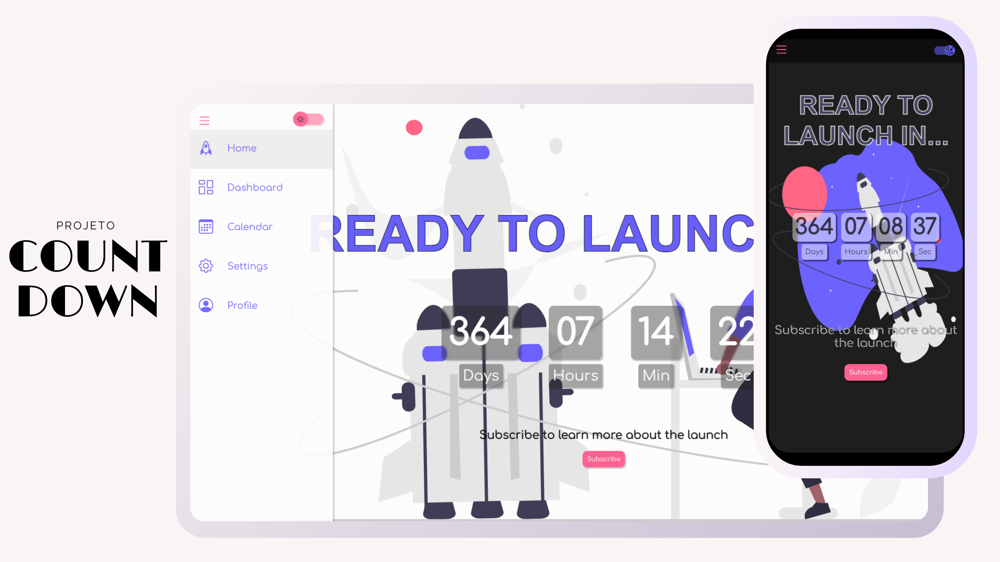

<h1 align="center">#5 News </h1>
<h2 align="center">Cadastro de E-mail para Notícias Diárias</h2>

    Mantenha-se informado diariamente com as últimas notícias diretamente na sua caixa de entrada!

  <a href="#-tecnologias">Tecnologias</a>&nbsp;&nbsp;&nbsp;|&nbsp;&nbsp;&nbsp;
  <a href="#-projeto">Projeto</a>&nbsp;&nbsp;&nbsp;|&nbsp;&nbsp;&nbsp;
  <a href="#-layout">Layout</a>&nbsp;&nbsp;&nbsp;|&nbsp;&nbsp;&nbsp;
  <a href="#-instruções-de-cadastro">Instruções de Cadastro</a>

  

 

  

## 🚀 Tecnologias

Esse projeto foi desenvolvido com as seguintes tecnologias:

- HTML e CSS
- [formsubmit.co](https://formsubmit.co) para capturar e-mails
- Git e Github
- Figma e Canva para design

## 💻 Projeto

Site de cadastro de E-mail para Notícias Diárias. É uma plataforma que permite aos usuários se cadastrarem para receber "as últimas notícias diretamente" em suas caixas de entrada de e-mail. Através do preenchimento do
formulário o site redireciona para um capcha de confirmação e o formsubmit.co envia o um texto de resposta automática para o usuário de e-mail cadastrado.

## 🔖 Layout

Você pode visualizar o layout do projeto através [DESSE LINK](<https://jasonaraujo1.github.io/projeto-news/>). 

## 📝 Instruções de Cadastro

1. Acesse o [News](<https://jasonaraujo1.github.io/projeto-news/>). 
2. Preencha o formulário de cadastro com seu endereço de e-mail.
3. Clique no icon de enviar(seta).
4. Verifique sua caixa de entrada de e-mail para confirmar a inscrição.

Após a confirmação, você começará a receber notícias diárias em seu e-mail!

## :memo: Licença

Esse projeto está sob a licença MIT.

---

Instruções pela [Sua Empresa/Equipe](https://seusite.com) :wave: [Participe da nossa comunidade!](https://discord.gg/sua-comunidade)
